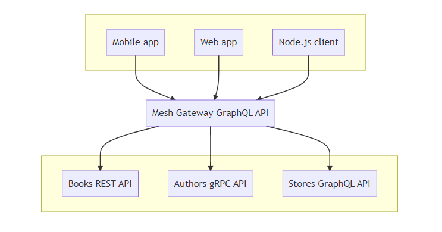

Adobe GraphQL Mesh
===



## Setting up your machine

1. Create Adobe IO Account

2. Install NPM and Node
    * NPM version 8+
    * Node version 16+ (even versions only)

3. Install Adobe IO CLI 
```
    npm install -g @adobe/aio-cli
```
4. Intall GraphQL Mesh Management Plugin
```
    aio plugins:install @adobe/aio-cli-plugin-commerce-admin
```
5. Create the GraphQL Mesh Configuration File - config.json with the following: 
```
    {
        "baseUrl": "https://graph.adobe.io",
        "apiKey": "commerce-graphql-onboarding"
    }
```
6. Setup your GraphQL Mesh Management Plugin with this configuration file
```
    aio-cli-plugin-commerce-admin config.json
```
## Create you endpoint (tenant) on the mesh

1. Make sure you have been provision for IMS Org `adobe-james-delorey` and sign into the [Developer Console](https://developer.adobe.com/console/home) to accept the usage terms

2. Create a tenant configuration, the following is structure for the tenant configuration:

```
    {
        "meshConfig": {
            "sources": [
                {  
                    "name": "<create_source_name>",
                    "handler": {
                    "graphql": {
                        "endpoint": "<public_full_path_gql_endpoint>"
                    }

                }
            }

        ]
    },
    "tenantId": "<unique_tenant_Id>"
    }
```
>**Note:** 
>- the tenant ID will be the part of your endpoint URL
```
        "tenantId": "<unique_tenant_id>" 
```
>- `sources` is an array, and you can add multiple endpoints to one mesh.
>- you can find sample tentant configuration(s) in the mesh-configuration folder.  Note that you will need to update the endpoint URL, authentication, and/or API token.

3. Switch your Adobe IO CLI is connected to the IMS Org `adobe-james-delorey`
```
    aio console:org:select
```

4.  Create your tenant on the GraphQL Mesh
```
    aio commerce-gateway:tenant:create ./mesh.json
```
>**Note:** replace `mesh.json` with your mesh configuration

5. Test your GraphQL Mesh Enpoint, 
```
    https://graph.adobe.io/api/<unique_tentant_id>/graphql?api_key=commerce-graphql-onboarding
```
>**Note:** the GraphQL Playground mode has been turned off you will need to use a GraphiQL Explorer Plugin. Here is the [GraphiQL extension for Chrome](https://chrome.google.com/webstore/detail/graphiql-extension/jhbedfdjpmemmbghfecnaeeiokonjclb?hl=en)

Here is a sample query if you are using a tenant configuration with the Venia GraphQL endpoint, found in the sample configuration.
```
    {
        storeConfig{
            base_url
            base_currency_code
            code
            locale
            welcome
        }
    }
```
6. Update your tenant on the GraphQL Mesh
```
    aio commerce-gateway:tenant:update tenantid ./mesh.json
```
>**Note:** 
>- you may need to remove the tenantId in the configuration.
>- replace `mesh.json` with your mesh configuration

## References

- [GraphQL Mesh Overview Recording](https://adobe-my.sharepoint.com/:v:/p/kchau/ESeF7H6TAYtKiihXPfiBWbcBuxCNC42UcsaGD7dG-UmwgQ)
- [GraphQL Mesh Adobe Wiki](https://wiki.corp.adobe.com/pages/viewpage.action?spaceKey=DMSArchitecture&title=Extensibility+Framework)
- [GraphQL Mesh Documentation](https://www.graphql-mesh.com/docs/introduction)

